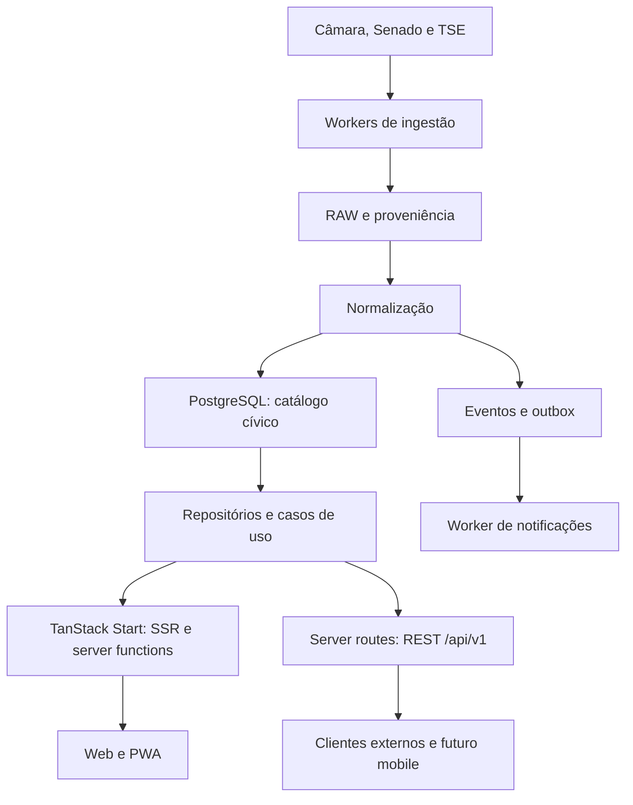

# Planejamento técnico e arquitetura — Plataforma cívica

Data: 06/10/2026. Stack escolhida pelo responsável: **TanStack Start**.

Este documento define **como organizar e operar o software**. O comportamento do produto está em [PLANEJAMENTO-FEATURES.md](PLANEJAMENTO-FEATURES.md); documentação de fornecedores e fontes está em [RECURSOS.md](RECURSOS.md). Trata-se de um desenho completo, sem divisão por etapas e sem afirmar que os componentes já foram implementados.

## 1. Direção arquitetural e limites

Monólito modular TypeScript com web e workers em processos separados. O principal ativo é o domínio cívico e a normalização confiável das fontes. O framework web deve permanecer substituível.

Escolher TanStack Start substitui a recomendação anterior de Next.js/React Router. A proposta abaixo usa as capacidades do Start sem obrigar um terceiro serviço Hono desde a inicialização. Essa é uma recomendação arquitetural consolidada para a nova escolha, não uma separação de serviços já implementada.

| Escolha | Diretriz |
| --- | --- |
| Web | React + TanStack Start + TanStack Router + Vite + TypeScript estrito. |
| Estado remoto | TanStack Query, integrado ao loader e à hidratação. |
| UI | Tailwind CSS + shadcn/ui; acessibilidade e mobile-first. |
| Validação | Zod em todas as fronteiras; DTOs explícitos. |
| Banco | PostgreSQL padrão hospedado no Supabase. |
| Consultas | Drizzle para catálogo público, ingestão e administração autorizada. |
| Auth | Supabase Auth; sessão web por integração SSR suportada e JWT para clientes externos. |
| Dados pessoais | Supabase client no contexto do usuário, com RLS e permissões apropriadas. |
| Importação | Workers Bun 1.4.2/TypeScript; adapters por instituição. |
| Agendamento | Scheduler que enfileira tarefas; execução longa no worker. |
| Busca | PostgreSQL FTS + `pg_trgm`; mecanismo externo só com necessidade medida. |
| Notificações | Outbox + worker; Resend como candidato para e-mail, push web quando adotado. |
| Observabilidade | Logs estruturados e Sentry como candidato para erros. |
| Repositório | GitHub, Bun workspaces (Bun 1.4.2) e Turborepo. |
| Hospedagem | Web compatível com o adapter oficial escolhido; Vercel é candidato, não requisito de domínio. Worker requer ambiente adequado a jobs longos. |
| Mobile | React Native/Expo previsto como consumidor HTTP; sem app nativo na inicialização. |

Não incluir microserviços, Kafka, Kubernetes, Redis, GraphQL ou Elasticsearch por antecipação. Também não presumir suporte automático a APIs Node em Cloudflare: a compatibilidade de runtime, driver e adapter precisa ser verificada quando esse alvo for escolhido.

## 2. Topologia



Supabase Auth autentica usuários; dados pessoais são consultados com o contexto verificado do usuário. O diagrama mostra fluxos de dados, não exposição direta do banco aos consumidores.

### Duas portas de entrada, mesmos casos de uso

- **Server functions:** adaptadores tipados usados pelo próprio site, para consultas e mutações. Não constituem API pública estável.
- **Server routes REST:** endpoints com contratos explícitos e versionados, acessíveis por mobile ou outros clientes conforme política de acesso.
- **Domínio/aplicação:** recebe parâmetros e contexto autorizado, executa regras e chama portas de repositório. Não conhece Start, Request, React, Drizzle ou Supabase.
- **Ingestão:** usa adapters oficiais e repositórios de escrita; não passa pela UI nem depende de uma requisição de usuário.

Uma server function não precisa fazer HTTP para uma server route no mesmo processo. Ambas podem chamar o mesmo serviço. Se existir necessidade concreta de escala independente, extrair a camada HTTP para `apps/api` com Hono/Fastify preservando domínio, contratos e repositórios.

Referências: [server functions](https://tanstack.com/start/latest/docs/framework/react/guide/server-functions) e [server routes](https://tanstack.com/start/latest/docs/framework/react/guide/server-routes).

## 3. Organização do monorepo

Estrutura de referência. Um diretório só precisa virar pacote quando tiver responsabilidade e uso real; não criar abstrações vazias para completar a árvore.

```text
plataforma-civica/
  apps/
    web/
      src/
        routes/
        features/
        server/
          functions/
          http/
          auth/
          composition/
      public/
    worker/
      src/
        jobs/
        schedules/
        composition/
  packages/
    domain/
      src/
        people/
        representation/
        legislation/
        voting/
        spending/
        elections/
        participation/
        following/
        notifications/
        ports/
    contracts/
    db/
    source-camara/
    source-senado/
    source-tse/
    ui/
    config/
  supabase/
    config.toml
    migrations/
    seed.sql
  scripts/
  docs/
    PLANEJAMENTO-FEATURES.md
    PLANEJAMENTO-TECNICO.md
    RECURSOS.md
    decisions/
  AGENTS.md
  README.md
  turbo.json
  package.json
  bun.lock
  .env.example
```

`routes` concentra roteamento, carregamento e composição visual. `features` organiza a UI por funcionalidade. `server/composition` instancia casos de uso com repositórios/adapters e contexto de autenticação.

### Dependências permitidas

| Módulo | Pode depender de | Não deve depender de |
| --- | --- | --- |
| domain | Tipos e bibliotecas pequenas de lógica pura | React, Start, Drizzle, Supabase, HTTP concreto. |
| contracts | Zod e tipos públicos estáveis | Conexão de banco, segredos, modelos de persistência completos. |
| db | Drizzle e portas/tipos do domínio | UI e roteamento. |
| source-* | Cliente HTTP, schemas externos e tipos de normalização | React, rotas e sessão de usuários. |
| ui | React e contratos visuais | Banco, workers e credenciais. |
| web | UI, contratos e domínio; db apenas no lado servidor | Imports server-only no bundle do navegador. |
| worker | Domínio, db e source-* | Execução dependente da web ou da sessão de um usuário. |

Interfaces devem refletir capacidades da fonte: parlamentares, tramitações, despesas e datasets eleitorais têm portas próprias. Não impor `getVotes()` ao TSE ou uma interface universal que esconda diferenças institucionais.

## 4. Modelo de domínio

### Pessoas, representação e tempo

- **Person:** identidade canônica, independente de cargo, partido e eleição.
- **Institution:** Câmara, Senado e futuras instituições, com esfera e jurisdição.
- **Mandate:** vínculo de pessoa, cargo, instituição, jurisdição e mandato institucional.
- **MandatePeriod:** períodos efetivos de exercício, licença, substituição ou suplência. Permite várias entradas da mesma pessoa no mesmo mandato sem gerar identidades duplicadas.
- **PartyMembership:** filiação com início/fim conhecido; não sobrescrever a história com o partido atual.
- **Party, ParliamentaryGroup:** partido distinto de federação/bloco; relações temporais quando necessárias.
- **Contact:** canal, titular institucional/pessoal, origem, validade e verificação.
- **Candidacy:** registro em eleição específica; não equivale a posse ou exercício.

Identificadores externos são strings e têm namespace de instituição/recurso. O mesmo número em duas fontes não identifica a mesma pessoa. Nome é indício para revisão, não chave de merge automático. Preservar origem, evidência e decisão de todo vínculo entre fontes; usar fila de revisão para casos ambíguos. Evitar importar CPF e outros identificadores sensíveis quando não forem necessários.

### Propostas e decisões

- **Proposal:** registro legislativo de uma Casa, preservando identificador oficial e situação original.
- **ProposalDocument:** texto, versão, tipo, URL oficial, hash e data.
- **ProposalRelationship:** emenda, substitutivo, apensação, parecer, envio/retorno de outra Casa e outras relações explícitas.
- **ProposalEvent:** evento de tramitação; ocorrência, órgão, sequência/ID oficial e evidência.
- **Voting:** decisão em órgão/data, modalidade, objeto e resultado.
- **VotingObject:** relação entre votação e documentos/propostas, com papel de cada objeto. Não presumir relação um-para-um entre projeto e votação.
- **Vote:** registro individual em votação nominal, pessoa/mandato, partido e código original naquele momento.
- **VotingOrientation:** orientação de bancada separada de voto individual.
- **Committee, CommitteeMembership, LegislativeEvent:** órgãos, composição por período e agenda.

Não juntar automaticamente PLs de Casas distintas só por número/ano. Conservar registros externos distintos e criar relação comprovada; isso permite exibir uma trajetória conjunta sem perder identidades oficiais.

### Fiscalização, participação e conta

- **Expense:** registro financeiro específico de um regime, com valores originais, categoria, documento, competência e retificações.
- **ParticipationOpportunity:** canal oficial, instituição, finalidade, URL verificada, prazo e vínculo opcional com matéria/evento.
- **Follow:** escolha privada de acompanhar pessoa/proposta/tema.
- **Notification:** consequência de evento verificável, preferências e deduplicação.
- **GeneratedSummary:** explicação derivada vinculada a documentos/versionamento e evidências.

## 5. Catálogo lógico de persistência

Nomes orientativos para schema real; não são migrations prontas. Campos e constraints devem ser ajustados às fontes verificadas e aos casos de uso implementados.

| Grupo | Tabelas previstas |
| --- | --- |
| Representação | `people`, `institutions`, `jurisdictions`, `legislatures`, `mandates`, `mandate_periods`, `parties`, `party_memberships`, `parliamentary_groups`, `group_memberships`, `contacts`. |
| Legislação | `proposals`, `proposal_authors`, `topics`, `proposal_topics`, `proposal_documents`, `proposal_relationships`, `proposal_events`. |
| Votações | `votings`, `voting_objects`, `votes`, `voting_orientations`. |
| Órgãos/agenda | `committees`, `committee_memberships`, `legislative_events`, `event_proposals`. |
| Gastos | `expenses`, `expense_categories`, `expense_documents`; fornecedor público só com necessidade e origem clara. |
| Eleições | `elections`, `candidacies`, `candidacy_assets`, `government_plans`, `candidacy_social_links`, `election_results` quando integrada a fonte de resultados. |
| Participação | `participation_opportunities`, relações tipadas a propostas/eventos e histórico de verificação dos links. |
| Conta | `profiles`, `followed_people`, `followed_proposals`, `followed_topics`, `notification_preferences`, `notifications`, `push_subscriptions`. |
| Derivações | `generated_summaries`, `summary_evidence`, `summary_reviews`. |
| Interno | `sources`, `source_resources`, mapeamentos de IDs por entidade, `raw_snapshots`, `raw_observations`, `sync_runs`, `sync_checkpoints`, `ingestion_errors`, `identity_reviews`, `jobs`, `outbox_events`, `notification_deliveries`, `audit_logs`. |

Preferir relações com FK reais em vez de um `entity_type/entity_id` sem integridade. Um catálogo genérico de proveniência pode existir, mas suas ligações ao domínio precisam de consistência verificável.

### Schemas e acesso

- `civic`: catálogo cívico normalizado; não exposto pela Data API por padrão. Web acessa por repositórios do servidor com papel de leitura limitado.
- `internal`: RAW, controle de importações, jobs, credenciais referenciadas e auditoria; não exposto e com papéis restritos.
- `public`: tabelas pessoais selecionadas, caso se use Data API; permissões explícitas e RLS em todas elas. Não colocar dados RAW ali.
- `auth`: gerenciado pelo Supabase; não replicar senhas ou modificar tabelas internas manualmente.

Uma publicação pública via REST não precisa expor as tabelas do banco. URLs e DTOs são a fronteira pública.

### Constraints e convenções

- IDs internos estáveis — por exemplo UUID — e identificadores externos preservados como texto.
- Unicidade de `(source, resource_type, external_id)` no mapeamento, respeitando o escopo real do ID.
- Um follow por `(user_id, target_id)`; FKs e deleção deliberada conforme necessidade.
- Voto com chave oficial ou composição validada de votação/participante; retificação conserva a revisão anterior.
- `timestamptz` para instantes, `date` quando a fonte fornece só dia; guardar precisão e fuso original quando relevante.
- Instantes internos UTC; agenda exibida no fuso do evento e, se útil, do usuário. Não assumir hora local brasileira a partir do ambiente do servidor.
- Dinheiro em `numeric` com precisão adequada ou centavos inteiros quando a fonte permitir; nunca float para somatórios.
- Código original + normalização: valores desconhecidos devem permanecer “desconhecidos”, não virar estado aparentemente válido.
- Índices a partir dos filtros concretos: Casa/UF, mandato/período, proposta/ano/tema, votação/data, despesa/competência e outbox/status.

## 6. Proveniência e RAW

Cada registro consultável precisa de evidência rastreável. Campos conceituais: fonte, identificador externo, URL oficial, URL do recurso coletado, `source_updated_at` quando fornecido, `fetched_at`, `last_verified_at`, `content_hash`, versão do normalizador e referência ao snapshot.

Não usar `updated_at` sozinho para significar todas essas datas. Verificação de um link, coleta de uma resposta e mudança real de dado são operações diferentes.

### Preservação de origem

- Respostas pequenas estruturadas podem ser guardadas como JSONB; conservar também bytes originais ou referência quando fidelidade exata/XML importar.
- Datasets grandes — ZIP/CSV/PDF — ficam em object storage privado com hash, tamanho, recurso oficial e metadados; não transformar um ZIP inteiro em uma linha JSONB.
- `raw_snapshots` guarda conteúdo deduplicado; `raw_observations` guarda cada observação/coleta sem duplicar os bytes.
- Uma mudança de hash cria nova versão; uma coleta sem mudança atualiza somente a observação/verificação.
- Tabela RAW não contém credenciais de usuário ou headers de autenticação. Reter apenas dados necessários e definir política de retenção.

Correção de normalização pode reprocessar snapshots sem buscar tudo novamente. Ainda assim, RAW não substitui novas coletas quando a fonte se corrigiu.

## 7. Ingestão e sincronização

Pipeline: descobrir recursos → coletar paginado → persistir evidência → validar schema externo → normalizar → resolver identidades → transação de atualização → evento/outbox → checkpoint.

### Regras de execução

- Concurrency limitada por fonte, timeout, retry com backoff/jitter e respeito a `Retry-After` quando aplicável.
- Não assumir limites públicos que não foram documentados; medir e registrar erros/latência.
- Checkpoint só avança após persistência bem-sucedida. Falha em uma página não confirma conclusão da importação.
- Idempotência por identidade externa e versão/hash. Concorrência protegida por leases/locks e constraints.
- `occurred_at` do fato difere de `observed_at` do sistema.
- Polling com janela de sobreposição e reconciliação periódica para mudanças retroativas; não confiar somente em filtro incremental sem garantia da fonte.
- Ausência em resposta parcial não apaga registros. Exclusão/desativação precisa de evidência ou reconciliação de conjunto completo.
- Importação histórica/backfill tem flag que suprime alertas de “novidade”; correções podem gerar evento próprio.
- Checkpoints e logs por recurso, versão de adapter e execução, com contagens e cobertura.

### Política de frequência proposta, configurável

| Recurso | Diretriz operacional |
| --- | --- |
| Pessoas, contatos, partidos | Consulta diária ou conforme mudança/limite da fonte. |
| Propostas e tramitações | Várias consultas por dia para registros ativos, menor frequência para histórico. |
| Agenda e votações recentes | Intervalos menores durante atividade, sem prometer votação em tempo real. |
| Votos | Após publicação de votação nominal e nova consulta para consolidação/retificação. |
| Despesas | Conforme publicação de cada regime, com reconciliação de competências anteriores. |
| TSE | Atualização por recurso/pleito, mais frequente no período eleitoral conforme disponibilidade. |
| Links de participação | Verificação periódica e revisão quando houver mudança de portal. |

Essas frequências são propostas nossas, não SLA das instituições. Câmara, Senado e TSE fazem parte do escopo completo; a Câmara é apenas uma boa fonte para validar o primeiro adapter concreto.

### Jobs e scheduler

Scheduler enfileira; worker executa. Supabase Cron é uma opção de scheduler, não o lugar para uma importação longa. A fila pode começar no PostgreSQL, atrás de uma porta, com implementação madura ou tabela de jobs bem definida; escolher uma implementação única e documentá-la.

Jobs persistentes precisam de status, tentativa, disponibilidade, lease, heartbeat para tarefas longas, limite de retries e falhas estacionadas para revisão. Entrega é pelo menos uma vez; idempotência é obrigatória. Não manter grandes jobs dependentes de memória ou de um único processo web.

## 8. TanStack Start: renderização e carregamento

- SSR completo nas páginas públicas de pessoas, propostas, votações, partidos e participação para indexação, leitura inicial e metadados.
- SSR também pode ser usado na área autenticada; páginas privadas sempre sem cache compartilhado.
- `ssr: false` ou `data-only` só por necessidade concreta de componente/rota. Não desabilitar SSR no layout ancestral de páginas públicas.
- Loaders podem executar na navegação do cliente. Acesso a banco deve acontecer por server function/handler servidor, nunca por suposição de que loader é server-only.
- Usar mecanismos oficiais de isolamento e proteção de imports, não confiar apenas no sufixo `.server.ts`. Conferir o alcance das guardas em pacotes do workspace fora de `src` e validar o bundle final; a documentação consultada marca import protection como experimental.
- QueryClient por requisição SSR; nunca singleton compartilhado entre usuários. Hidratar apenas dados que possam chegar ao cliente.
- Loader e Query compartilham query keys/options para evitar fetch duplo. Mutação invalida os recursos afetados.
- URL concentra busca, filtros, ordenação e paginação públicos; estado visual local permanece em React. Nenhum segredo/follow privado vai ao URL público.
- Páginas com estados loading, vazio, erro recuperável, fonte desatualizada e não encontrado.

Referências: [SSR seletivo](https://tanstack.com/start/latest/docs/framework/react/guide/selective-ssr), [modelo de execução](https://tanstack.com/start/latest/docs/framework/react/guide/execution-model), [search params](https://tanstack.com/router/latest/docs/guide/search-params).

### SEO, cache e PWA

Metadados por entidade, canonical, OpenGraph, sitemap paginado e 404 real. Dados estruturados apenas quando correspondem ao conteúdo. Não indexar páginas pessoais nem gerar infinitas combinações de filtros como páginas canônicas.

Cache público com TTL e invalidação definidos por recurso; última verificação visível. Respostas autenticadas com política privada/no-store e cache keys isoladas. Assets podem ter cache longo por hash. Service worker não armazena indiscriminadamente respostas privadas ou tokens; logout remove caches pessoais. Não enfileirar manifestação oficial offline como se estivesse concluída.

## 9. Contratos e API

`packages/contracts` contém schemas de entrada, DTOs públicos, erros estáveis e paginação. Não devolver linhas Drizzle completas, RAW, credenciais ou metadados de revisão privada.

Exemplos de endpoints **do nosso produto**, não APIs governamentais já existentes:

| Contrato proposto | Finalidade |
| --- | --- |
| `GET /api/v1/representatives` | Diretório filtrável. |
| `GET /api/v1/people/:id` | Pessoa e contexto de representação. |
| `GET /api/v1/people/:id/mandates` | História de mandatos. |
| `GET /api/v1/people/:id/votes` | Registros individuais contextualizados. |
| `GET /api/v1/people/:id/expenses` | Despesas por regime/período. |
| `GET /api/v1/proposals` e `/:id` | Busca e detalhe. |
| `GET /api/v1/proposals/:id/events` | Tramitação. |
| `GET /api/v1/votings` e `/:id/votes` | Decisões e registros nominais. |
| `GET /api/v1/parties`, `/committees`, `/events` | Partidos, órgãos e agenda. |
| `GET /api/v1/elections/:id/candidacies` | Registros eleitorais. |
| `GET /api/v1/participation-opportunities` | Ações oficiais verificadas. |
| `GET /api/v1/me/feed` e `/me/follows` | Área pessoal autenticada. |
| `PUT /api/v1/me/follows/people/:id` | Follow idempotente. |
| `DELETE /api/v1/me/follows/people/:id` | Deixar de seguir. |
| `PATCH /api/v1/me/notification-preferences` | Preferências privadas. |

Seguir propostas/temas usa contratos equivalentes. Usar `/representantes`, `/propostas`, `/votacoes`, `/participe`, `/eleicoes` e `/meu-brasil` para URLs web em pt-BR; código e API podem usar inglês de maneira consistente.

Paginação limitada, ordenação determinística com desempate por ID, cursor em feeds/eventos e estratégia documentada para busca. Erros com `code`, mensagem segura e `requestId`; status HTTP coerentes. Identidade em `/me` deriva do token/sessão verificado, nunca de `userId` livre no body. Documentar REST em OpenAPI quando os contratos forem implementados.

API pública de dados é possibilidade: abertura, limites e política de acesso continuam pendentes. Versionar desde já não obriga a disponibilizá-la irrestritamente.

## 10. Autenticação, autorização e Supabase

Verificar docs atuais de SSR/Auth e changelog antes de implementar. Usar integração suportada, validação de token no servidor e propagação correta de cookies. Não assumir autorização por ler `getSession()` ou armazenar um ID no cliente.

- Acesso público de leitura ao catálogo pela aplicação.
- Dados pessoais: cliente Supabase com JWT/contexto do usuário, políticas de propriedade e grants explícitos.
- Leitura pública via Drizzle: papel de banco somente leitura para `civic` quando viável.
- Ingestão: papel de escrita necessário a `civic/internal`; migrations usam credencial separada.
- Administração: papel verificado em dado protegido; não usar `user_metadata` editável para conceder privilégio.

**Limite importante:** Drizzle conectado por `DATABASE_URL` não transmite automaticamente o JWT Supabase nem aplica a identidade do usuário. Uma conexão com papel que ignora RLS não recebe proteção por existir uma policy. Portanto, o padrão deste projeto reserva Drizzle para catálogo/ingestão e usa cliente no contexto do usuário para follows, feed e preferências. Exceções exigem desenho explícito e testes entre dois usuários.

RLS inclui `USING` e `WITH CHECK` pertinentes e impede troca de proprietário. Views expostas devem preservar RLS, por exemplo com `security_invoker` quando suportado. `internal` não é schema exposto. Credenciais administrativas nunca chegam ao navegador.

Server functions e mutações web precisam de proteção contra CSRF conforme configuração atual do Start; validar Origin onde aplicável, cookies seguros e operações de escrita por método apropriado. REST externo tem CORS restrito às origens adotadas e validação própria de bearer token. Proteção no layout não substitui autorização em cada handler/caso de uso.

Fontes: [RLS](https://supabase.com/docs/guides/database/postgres/row-level-security), [API segura](https://supabase.com/docs/guides/api/securing-your-api), [SSR/Auth](https://supabase.com/docs/guides/auth/server-side).

## 11. Busca e interpretação

FTS com configuração portuguesa nos textos adequados e `pg_trgm` para nomes/identificadores. Preservar texto original; definir normalização de acentos e índices de acordo com queries reais. Filtros SQL parametrizados e limite de resposta.

Relevância de busca é lexical/documental, não avaliação do político. Classificações oficiais e taxonomia própria têm namespace e mapeamento separado. Não adicionar busca vetorial, Elasticsearch ou recomendação política antes de existir necessidade concreta.

## 12. Resumos com IA

Pipeline de worker: documento oficial/versionado → extração validada → geração estruturada → validação/evidências → revisão conforme política → armazenamento/publicação.

- Guardar fornecedor/modelo, versão de prompt, documentos e hashes, horário, custo estimado/real disponível e status de revisão.
- Schema de saída: resumo curto, mudanças propostas, grupos afetados apenas com evidência, termos, limitações e trechos/fontes associados.
- Comparar “hoje” e “proposta” requer norma vigente também como entrada verificável.
- Conteúdo externo é dado, não instrução: resistir a prompt injection em PDFs/textos e não dar ferramentas privilegiadas ao resumo.
- Validação de schema não prova veracidade. Usar verificação de vínculo com texto, testes com casos difíceis, revisão humana definida e bloqueio quando a evidência falha.
- Alteração de documento invalida resumo anterior; conservar histórico e expor a versão efetivamente resumida.
- PDF escaneado/OCR e falta de texto precisam de estado específico; não gerar explicação com contexto insuficiente.
- Provedor de IA em aberto; porta substituível e orçamento/rate limit configuráveis. Não criar dependência obrigatória para leitura dos dados oficiais.

## 13. Eventos e notificações

Histórico legislativo é tabela de eventos com projeção de situação atual; não exige arquitetura de event sourcing integral.

Transação que muda o domínio grava evento de outbox. Worker transforma esse evento em notificações por preferências. Deduplicar por usuário/evento/canal, com ID estável que não muda a cada coleta.

Envio externo não participa da transação SQL: usar retries, ID de idempotência no provedor quando suportado e status de tentativa/entrega separado. Registrar bounce/descadastro e assinaturas de webhooks verificadas. Não prometer exactly-once; desenhar para repetição sem duplicata visível sempre que possível.

Backfill não cria alertas de evento recente. Preferências e pausa são conferidas no envio. Cron pode disparar resumo periódico; push inválido é desativado. Resend/Sentry não recebem listas de follows em logs, e o conteúdo do e-mail respeita o necessário para a mensagem.

## 14. Migrations, conexão e ambiente local

Uma única cadeia de migrations SQL em `supabase/migrations`, aplicada pelo fluxo Supabase documentado. Drizzle representa o schema e oferece queries; não rodar Drizzle Kit e Supabase como dois históricos independentes. Se gerar SQL com Drizzle, incorporar/revisar dentro da cadeia escolhida, incluindo grants, RLS, índices e extensões.

CLI e nome de migration criados por comando oficial atual, descoberto via `--help`. Não inventar formato de timestamp. Testar criação em banco vazio e mudança sobre base com dados.

Supabase local via CLI/Docker, seed fictício determinístico e serviço web executável em modo demo explícito se o banco local não existir. Não acessar produção como fallback. Migrations, seeds e importações são operações diferentes.

Conexão/pooler depende do runtime: serverless pode exigir pool de transação e configuração compatível de prepared statements; worker e migrations podem usar outra rota suportada. Limitar pools por processo e consultar a [documentação de conexão](https://supabase.com/docs/guides/database/connecting-to-postgres). Não supor que uma única URL resolve todos os usos.

### Variáveis conceituais

| Variável | Uso e exposição |
| --- | --- |
| `APP_NAME`, `APP_URL` | Marca provisória e URL canônica; configuração pública só do necessário. |
| `SUPABASE_URL`, `SUPABASE_PUBLISHABLE_KEY` | Auth/Data API; publicação conforme SDK e env do Start adotados. |
| `DATABASE_URL` | Conexão privada da aplicação/worker, com papel adequado por processo. |
| `MIGRATION_DATABASE_URL` | Conexão privada para migrations. |
| `SUPABASE_SECRET_KEY` | Apenas operações administrativas que realmente precisem; nome atual a validar. |
| `RESEND_API_KEY`, `EMAIL_FROM` | E-mail do worker. |
| `SENTRY_DSN` e token de upload quando necessário | Erros/source maps com exposição adequada e scrub de dados. |
| `TRANSPARENCY_API_TOKEN` | Token opcional do Portal da Transparência, somente servidor. |
| `AI_PROVIDER_API_KEY`, `AI_MODEL` | Geração opcional, somente worker. |
| `SYNC_*`, `DEMO_MODE` | Limites/frequência e modo fictício explicitamente configurado. |

São nomes de planejamento, não nomes que os fornecedores exigem. Prefixos públicos do Vite/Start devem ser validados no scaffold instalado; nunca prefixar segredos para resolver erro de configuração. `.env.example` usa placeholders; `.env` e dumps privados ficam fora do git.

## 15. Observabilidade, recuperação e custos

- Logs estruturados com execução/job/recurso, duração, contagens e código de erro. Sem tokens, conteúdo de mensagem pessoal ou follows.
- Métricas de atraso entre coleta e fonte, falhas por adapter, cobertura, identidade ambígua, API lenta, fila acumulada e notificações duplicadas.
- Readiness/liveness sem revelar credenciais ou payloads; painel operacional privado.
- Backups e teste de restauração; registrar RPO/RTO escolhidos. RAW facilita reprocessamento, mas não substitui backup dos dados pessoais.
- Limites para storage RAW, egress, consultas, histórico, geração IA e envio. Alertar responsáveis sobre falha operacional sem criar nova plataforma de monitoramento.
- Ambientes local, preview e produção separados; preview não usa segredos/dados pessoais de produção.
- Retenção de logs/RAW e limpeza auditável; não conservar tudo indefinidamente por conveniência.

## 16. Privacidade e dados políticos

Escolhas de acompanhamento podem revelar interesses/posições. Como critério de engenharia, mantê-las privadas, minimizar coleta e evitar compartilhamento com analytics/segmentação publicitária. Opinião política é categoria de dado pessoal sensível na definição da ANPD; isso não significa que todo clique isolado tenha automaticamente a mesma classificação jurídica.

Definir finalidade, retenção, exclusão/exportação e base aplicável antes da operação pública. Nenhuma inferência ideológica, publicidade por posicionamento ou acesso de terceiros às listas pessoais está no escopo. A revisão desses requisitos é pendência concreta de operação do produto, não motivo para impedir o scaffold.

Referência: [glossário da ANPD](https://www.gov.br/anpd/pt-br/documentos-e-publicacoes/glossario-anpd).

## 17. Verificação e qualidade

| Tipo | O que precisa comprovar |
| --- | --- |
| Unidade | Normalização de códigos, dinheiro/datas, identidade, filtros, regras de estado e eventos. |
| Adapter/contrato | Fixtures reais reduzidas e versionadas, paginação, campos ausentes, schema novo, retificação e encoding. |
| Banco | Constraints, reexecução idempotente, transação/outbox, checkpoint e migration em banco limpo. |
| Segurança | Usuário A não acessa dados de B; anônimo bloqueado em mutações; Data API/views não expõem interno; banco/segredos ausentes no bundle. |
| E2E | Descobrir UF → perfil → proposta → votação → ação oficial; login → seguir → feed → deixar de seguir. |
| Renderização | HTML público contém conteúdo/metadados; nenhuma hidratação inconsistente ou cache privado compartilhado. |
| Operação | Falha/retry de fonte, backfill sem alertas, falha de envio e recuperação do job. |

Vitest para lógica/integrações locais e Playwright para fluxos relevantes. Checks de contrato online são opt-in ou agendados, nunca requisito de teste unitário. Fixtures não importam dados pessoais excessivos e não são confundidas com dados de produção.

Pipeline de CI: install com lockfile → lint → typecheck → testes pertinentes → build; testes de banco/E2E em ambiente isolado quando disponíveis. Não exigir percentuais artificiais de cobertura: proteger os comportamentos e riscos reais.

## 18. Documentação viva e decisões pendentes

`AGENTS.md` registra leitura obrigatória dos três documentos, limites de imports, regras de fontes/neutralidade e comandos reais. `README.md` descreve execução, configuração e estado implementado. Decisões novas relevantes podem ganhar ADR curto em `docs/decisions` com motivo e consequências, sem reescrever todo o histórico da conversa.

Pendente: nome/domínio, métodos de login, implementação da fila, provedor do worker, alvo de deploy web, cobertura histórica, regras de alertas, fornecedor/revisão de IA, orçamento, retenção e política de API externa. Não é necessário decidir tudo para inicializar; usar portas claras e registrar escolhas concretas.

Ao inicializar, consultar releases/documentação atuais e registrar versões realmente instaladas. Declarações anteriores sobre RC, majors de frameworks ou recursos recém-lançados não substituem essa verificação.

## Atualização de decisão — 07/10/2026

Bun **1.4.2** passa a ser o runtime da web e dos workers e o único gerenciador de pacotes. Workspaces ficam no `package.json`; `bun.lock` é o único lockfile. Vite continua sendo o pipeline de build (`bun --bun vite`), com checagem estática TypeScript separada. Vitest e Playwright permanecem. Consulte [ADR 001](decisions/001-bun-e-fundacao-local.md) e o README para comportamento implementado e validações. O restante do planejamento permanece integral.
